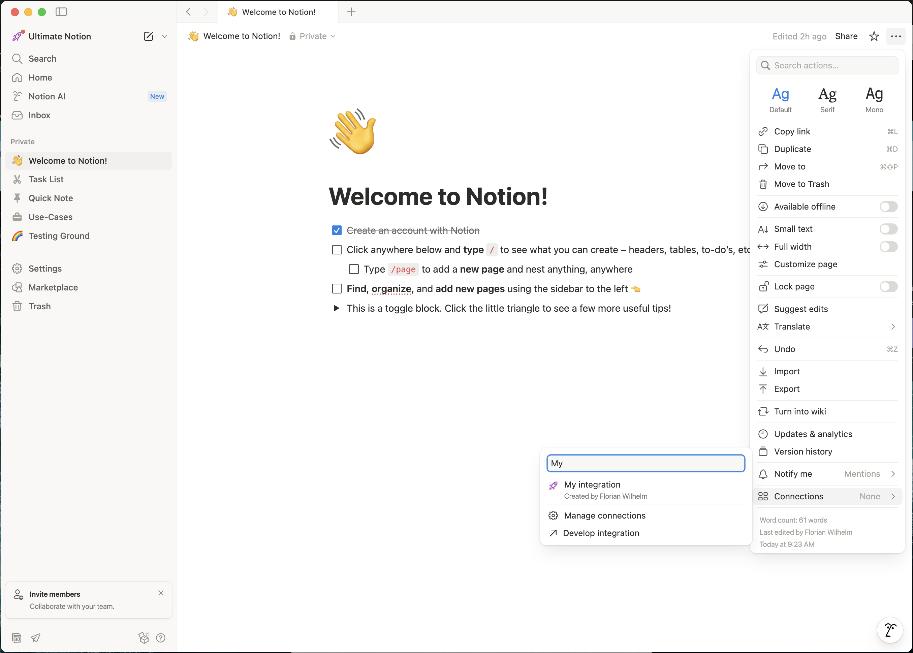

# Getting Started

## Installation

To install Ultimate Notion simple run:

```console
pip install ultimate-notion
```

Ultimate Notion needs at least Pyton 3.10. Depending on your system, you might need to use [pyenv], [conda], etc. to
install a more recent version.

## Creating an integration

Now open the web interface of [Notion], select a workspace, click <kbd>Settings & members</kbd>, click <kbd>Connections</kbd>
and choose <kbd>Develop or manage integrations</kbd>. This should take you to the [My integrations] site. Now select
<kbd>+ Create new integration</kbd>, provide a name, a logo and select the Notion workspace the integration should be
associated to. After that click the <kbd>Submit</kbd> button.

{: style="height:600px; display:block; margin-left:auto; margin-right:auto;"}

This brings you to the Secrets-site where you need to copy and save the *Internal Integration Token*, which always starts
with `secret_`. This token will be used by Ultimate Notion for authentication.


## Granting access to a page for an integration

Open Notion, i.e. the web interface or your Notion app. Make sure the integration you created shows up under
<kbd>Settings & members</kbd> » <kbd>Connections</kbd>. Now select any page you want to access via Ultimate Notion and
select the <kbd>···</kbd> on the upper right. In the drop-down menu, scroll down, select <kbd>+ Add connections</kbd>,
search and select your created integration. A pop-up that you need to confirm will inform you that your integration
will have access to the selected page as well as all its children.

{: style="width:400px; display:block; margin-left:auto; margin-right:auto;"}


## Access the page with Python

To try out if your integration works, just copy&paste the following code into your favorite editor or better [Jupyter Lab]. Replace the content
of `TOKEN` with the Internal Integration Token you saved and the content of `PAGE_TITLE` with the title of the page, you granted
access for your integration.

``` py
--8<-- "../../examples/getting_started.py"
```

Run the code and you should see in Jupyter Lab following rendered Markdown code or just the plain output if you run the
code in a terminal.

{: style="width:400px; display:block; margin-left:auto; margin-right:auto;"}

## Important concepts of Notion

In Notion everything is either a *page* or a *block*. A page contains a number of blocks, e.g. headings, text,
bulleted list, tables, quotes and so on.

An important and special block is the *database*, which may be within a page, i.e. *inline*, as a block
or at the same hierarchy level as a *page*. A *database* has a *schema*, that specifies various structured *properties*
of the individual pages contained in that database. Only pages contained in a database have properties. Notion itself
also offers *linked databases* (with ↗ next to the database title) but those are not accessible via the API, thus you must
always work with the source database.

Regardless of the properties, each page has *attributes* such as a title, cover, icon, or whether it is archived or not. The *title*
attribute of a page is special and will always be shown as database property, while the actual name of the property
can be customized. Consequently, a schema always has a title property. When a page is in a database, think of the title
as a kind of primary key or human-readable identifier, but it does not have to be unique! This concept is important
when *relation* properties are used between different databases as the title property of a linked page will show up in the relation
column.
If a page is deleted by you using Ultimate Notion, it will not be deleted but *archived* and this page attribute will be set accordingly.

A page, e.g. with title "child-page", can be contained in another page, e.g. with title "parent-page". This leads to a
hierarchy that is typically used for structuring content. We say that "parent-page" is the *parent* of "child-page" and
"child-page" is one of the *children* of "parent-page". A page at the root of the workspace has the workspace itself as parent.
This concept is important as access permissions for integrations are inherited from parent pages. Permissions can
only be granted to pages, not to complete workspaces encompassing all pages.

To identify a page, block, user, comment or even a property, Notion assigns each of them a universally unique identifier (UUID),
which is composed of 32 hexadecimal digits, potentially structured in various fields by a dash, i.e. `-`.
Using for instance, the uuid of a database instead of its title, always you to reference it in your code even after someone
changed its title. The UUIDs of pages and databases can be retrieved by using the web interface of Notion or using
<kbd>Copy link</kbd> from the <kbd>···</kbd>-menu in the upper right corner. The link will have the schema:

    https://www.notion.so/{Title}-{UUID}?{PARAMS}

UUIDs of other entities like blocks, properties, users etc. can only be retrieved via the API. Ultimate Notion provides
an `id`-property on most of its objects for that.

[My integrations]: https://www.notion.so/my-integrations
