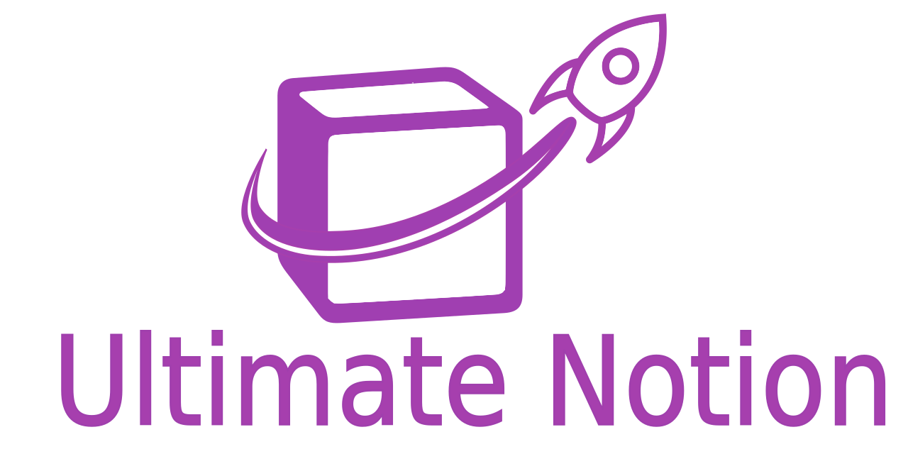

# Ultimate Notion

{: style="height:200px; display:block; margin-left:auto; margin-right:auto;"}

 

Ultimate Notion is the ultimate Python client for [Notion] with a rich set of features:

- 🐍 **Pythonic API** — Clean, intuitive Python interfaces with robust type annotations.
- 🗂️ **CRUD operations** — Create, read, update, and delete Notion pages, databases, and blocks.
- 🔎 **Rich querying capabilities** — Support for filters, sorting, pagination, and searching.
- 🪄 **Flexible export options** — Convert Notion content to Markdown, HTML, pandas, or Polars data frames.
- 🧩 **Built atop notion-sdk-py** — Enhancing the functionality of the popular low-level client.
- 🔒 **Token-based authentication** — Secure access using Notion integration tokens.
- 🚀 **One-step setup** — Getting up to speed with a [simple setup guide].

👉 Want to learn more? Explore the full [feature breakdown](features.md).

Ultimate Notion is distributed under the terms of the [MIT] license.

## Navigation

Documentation for specific `MAJOR.MINOR` versions can be chosen by using the dropdown on the top of every page.
The `dev` version reflects changes that have not yet been released. Shortcuts can be used for navigation, i.e.
<kbd>,</kbd>/<kbd>p</kbd> and <kbd>.</kbd>/<kbd>n</kbd> for previous and next page, respectively, as well as
<kbd>/</kbd>/<kbd>s</kbd> for searching.
