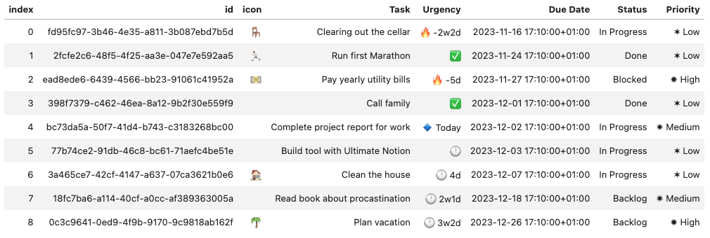

# Introduction to databases

Databases are one of the most versatile and powerful features of Notion.
Working programmatically with your databases extends Notion's functionality infinitely,
as you can use Python for all kinds of transformations, external data services, and much more.
Ultimate Notion unleashes the full power of Python for use with Notion's databases.
So let's see what we can do.

## Searching for a database

Assume we have a database called *Contacts DB*.

```python
import ultimate_notion as uno

notion = uno.Session.get_or_create()  # if NOTION_TOKEN is set in environment

contacts_dbs = notion.search_db('Contacts DB')

assert [db.title for db in contacts_dbs] == ['Contacts DB']
```

The method `search_db` will always return a list, as Notion gives no guarantees that the
title of a database is unique. Practically though, most users give databases unique
names, and to accommodate this, the returned list provides a method `.item()`, which
will return the item of a single-item list or raise an error otherwise. Another possibility
is to retrieve the database by its unique ID.

```python
contacts_db = notion.search_db('Contacts DB').item()
# or in case the unique ID of the database is known
contacts_db = notion.get_db(contacts_db.id)
```

The [Database object] provides access to many attributes like [title], [icon], [description], etc.

```python
assert contacts_db.description == 'Database of all my contacts!'
```

## Creating a database and adding pages

A simple database with the default columns `Name` for the title of pages and the Multi-select column `Tags`
can be created using [create_db]. To tell Notion where to put the database, we have to provide an existing page.
Let's assume we have a page called `Tests` that is shared with our integration:

```python
root_page = notion.search_page('Tests').item()
my_db = notion.create_db(parent=root_page)
```

Using the `my_db` object, we can now set its attributes, e.g.:

```python
my_db.title = 'My DB'
my_db.description = 'This is my database for cool Python libraries!'
```

!!! info
    Unfortunately, the Notion API does not support setting the *icon* or the *cover* of a database.

We can now simply add a new page to this database and set some attributes:

```python
new_page = my_db.create_page(name='Ultimate Notion')
new_page.description = 'Notes about Ultimate Notion'
new_page.icon = '🚀'
new_page.cover = 'https://www.notion.so/images/page-cover/woodcuts_2.jpg'
```

This is how *My DB* looks right now.

{: style="width:500px; display:block; margin-left:auto; margin-right:auto;"}

But how can I figure out which keyword arguments to pass to [create_page]? For this, we can take a look at the [schema]
of the database, which also allows us to create new pages in a neat way. As our database holds *tools*, we can express
this by naming the variable for the schema accordingly. An example illustrates this:

```python
Tool = my_db.schema
Tool.show()
```

This shows us that our database has two columns, `Name` and `Tags`, as well as the name of the arguments for [create_page].

```console
Name    Property     Attribute
------  -----------  -----------
Tags    MultiSelect  tags
Name    Title        name
```

A new page can now also be created using `Tool`, i.e.:

```python
new_tool = Tool.create(name='Ultimate Notion')
```

This is basically just an alias for [create_page] but can make your code much more expressive.

## Viewing the pages of a database

Assume we have a simple database listing tasks like this:

{: style="width:600px; display:block; margin-left:auto; margin-right:auto;"}

To access the tasks, i.e., the pages within this database, we can use the [get_all_pages] method to
generate a [View]. It's as simple as:

```python
task_db = notion.search_db('Task DB').item()
task_view = task_db.get_all_pages()
```

To get a quick overview of our tasks, we can use [show]. On the console, this will print:

```console
Task                              Status       Priority    Urgency    Due Date
--------------------------------  -----------  ----------  ---------  -------------------------
Clearing out the cellar           In Progress  ✶ Low       🔥 -2w2d   2023-11-16 17:10:00+01:00
Run first Marathon                Done         ✶ Low       ✅         2023-11-24 17:10:00+01:00
Pay yearly utility bills          Blocked      ✹ High      🔥 -5d     2023-11-27 17:10:00+01:00
Call family                       Done         ✶ Low       ✅         2023-12-01 17:10:00+01:00
Complete project report for work  In Progress  ✷ Medium    🔹 Today   2023-12-02 17:10:00+01:00
Build tool with Ultimate Notion   In Progress  ✶ Low       🕐 1d      2023-12-03 17:10:00+01:00
Clean the house                   In Progress  ✶ Low       🕐 5d      2023-12-07 17:10:00+01:00
Read book about procrastination    Backlog      ✷ Medium    🕐 2w2d    2023-12-18 17:10:00+01:00
Plan vacation                     Backlog      ✹ High      🕐 3w3d    2023-12-26 17:10:00+01:00
```

or in [JupyterLab] this will be shown as:

{: style="width:600px; display:block; margin-left:auto; margin-right:auto;"}

Special columns for the index, the page's ID, and its icon can be activated using
[with_index], [with_id], and [with_icon], respectively:

```python
task_view.with_index().with_id().with_icon()
```

{: style="width:600px; display:block; margin-left:auto; margin-right:auto;"}

The index can now be used to retrieve a specific page with [get_page], or we could just
convert the whole view to a [Pandas] dataframe with [to_pandas].

## Working with views

Views help you set the stage for various operations like exporting with the help of the various `to_*` methods
or applying a function to the contained pages using [apply]. With [select], the view can be restricted to
certain columns, whereas [head] (with alias [limit]) and [tail] can be used to restrict the number of rows in the view, e.g.:

```python
task_view.select('Task', 'Status').head(3).show(simple=True)
```

```console
Task                      Status
------------------------  -----------
Clearing out the cellar   In Progress
Run first Marathon        Done
Pay yearly utility bills  Blocked
```

All methods return a new view without modifying the current one, which allows keeping
different views at the same time. To reset the current view object, the [reset] method can be used.
To reload the view, i.e., re-execute the query that led to the view, use [reload].

Find out more about the functionality of [View] by reading the API references, but
keep in mind that some methods are just stubs.

[Database object]: ../../reference/ultimate_notion/database/#ultimate_notion.database.Database
[get_all_pages]: ../../reference/ultimate_notion/database/#ultimate_notion.database.Database.get_all_pages
[title]: ../../reference/ultimate_notion/database/#ultimate_notion.database.Database.title
[icon]: ../../reference/ultimate_notion/database/#ultimate_notion.database.Database.icon
[description]: ../../reference/ultimate_notion/database/#ultimate_notion.database.Database.description
[View]: ../../reference/ultimate_notion/view/#ultimate_notion.view.View
[show]: ../../reference/ultimate_notion/view/#ultimate_notion.view.View.show
[with_index]: ../../reference/ultimate_notion/view/#ultimate_notion.view.View.with_index
[with_id]: ../../reference/ultimate_notion/view/#ultimate_notion.view.View.with_id
[with_icon]: ../../reference/ultimate_notion/view/#ultimate_notion.view.View.with_icon
[get_page]: ../../reference/ultimate_notion/view/#ultimate_notion.view.View.get_page
[to_pandas]: ../../reference/ultimate_notion/view/#ultimate_notion.view.View.to_pandas
[apply]: ../../reference/ultimate_notion/view/#ultimate_notion.view.View.apply
[select]: ../../reference/ultimate_notion/view/#ultimate_notion.view.View.select
[reset]: ../../reference/ultimate_notion/view/#ultimate_notion.view.View.reset
[reload]: ../../reference/ultimate_notion/view/#ultimate_notion.view.View.reload
[head]: ../../reference/ultimate_notion/view/#ultimate_notion.view.View.head
[limit]: ../../reference/ultimate_notion/view/#ultimate_notion.view.View.limit
[tail]: ../../reference/ultimate_notion/view/#ultimate_notion.view.View.tail
[create_db]: ../../reference/ultimate_notion/session/#ultimate_notion.session.Session.create_db
[create_page]: ../../reference/ultimate_notion/database/#ultimate_notion.database.Database.create_page
[schema]: ../../reference/ultimate_notion/schema/#ultimate_notion.schema.Schema
