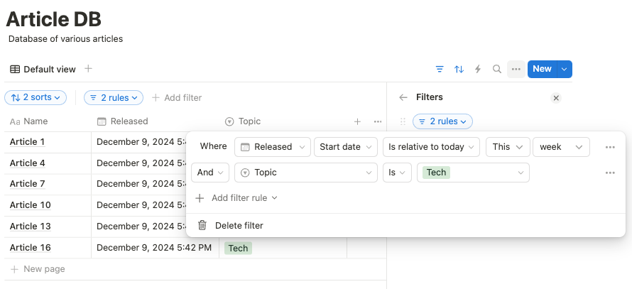

# Querying databases

Notion provides sophisticated database capabilities similar to traditional relational
databases, which are accessed with the help of the Structured Query Language (SQL).

With the *Relation* property, you can express Foreign Key relationships and Joins while the
*Rollup* property allows aggregations like Group By operations in SQL. The two missing, basic,
SQL query operations are the Where and Order By clauses, which correspond to *filtering* and
*sorting* in Notion. These are especially useful in Notion when we want to retrieve
specific pages from a database given some conditions on properties. Ultimate Notion provides
a programatic way, inspired by [PySpark] and [Polars], to query Notion databases.

We first create a Notion session and retrieve a page called `Tests`, which we assume
to be connected with our Ultimate Notion integration:

```python
import ultimate_notion as uno
import pendulum as pnd

notion = uno.Session.get_or_create()
root_page = notion.search_page('Tests', exact=True).item()
```

We create a database `Article` with properties name, topic and release date.
Then we populate the database with some pages:

```python
class Topic(uno.OptionNS):
    """Namespace for topics of our articles"""
    TECH = uno.Option(name='Tech', color=uno.Color.GREEN)
    POLITICS = uno.Option(name='Politics', color=uno.Color.YELLOW)
    FINANCE = uno.Option(name='Finance', color=uno.Color.RED)


class Article(uno.Schema, db_title='Article DB'):
    """Database of various articles"""
    name = uno.PropType.Title('Name')
    topic = uno.PropType.Select('Topic', options=Topic)
    released = uno.PropType.Date('Released')

article_db = notion.create_db(parent=root_page, schema=Article)

num_of_articles = 18
for i in range(num_of_articles):
    Article.create(
        name=f'Article {i+1}',
        topic=Topic.to_list()[i % len(Topic)],
        released=pnd.now().subtract(years=i % len(Topic))
    )
```

To query this database, we can retrieve a [Query][query object] object from the attribute
[query][query property] of `article_db`. Calling the method [execute] of the [Query][query object] object
will retrieve all pages, which is equivalent to calling the method [get_all_pages] of `article_db`
to get a [View]:

```python
view_of_all_pages = article_db.query.execute()
assert len(view_of_all_pages) == num_of_articles
```

## Filtering & sorting

The concept of filtering is really easy. We use a *boolean condition* to filter for the
pages in a database that we want to retrieve. A basic term of a condition consists of
a property and boolean operation, e.g. `uno.prop('Name') == 'Article 1'`. We use
[prop] to create a [Property] object, which we can then use for boolean operations like
`==`, `contains(...)`, etc. Several conditions can be composed with the boolean operators
`&` for logical *and* as well as `|` for *or*.

A simple example illustrates this. Assume that we want to retrieve all articles about the
topic *Tech* that were released this week. We then want to sort those articles descending
by their release date and ascending by their name, i.e. alphabetically sorted,
to break ties. We can simple define the property condition as well as sorting directions
and pass it to the [Query][query object] object using its `filter` and `sort` methods,
respectively:

```python
condition = (uno.prop('Topic') == Topic.TECH) & uno.prop('Released').this_week()
sort_directions = uno.prop('Released').desc(), uno.prop('Name').asc()

pages = article_db.query.filter(condition).sort(*sort_directions).execute()
assert len(pages) == num_of_articles / len(Topic)
```

!!! danger
    A common mistake is to forget the parentheses when using `&` and `|` to compose
    several conditions. Due to the precedence rules for operators, e.g. `==`, `!=`,
    in Python, this may lead to an unexpected exception, e.g. `TypeError: unsupported operand type(s) for &`,
    since `&` operates on a property instead of a condition.

Using the Notion UI to get the same result, we would define an *Advanced filter* on a view like this:

{: style="height:300px; display:block; margin-left:auto; margin-right:auto;"}

It should also be noted that the methods `filter` and `sort` of [Query][query object] return a
new [Query][query object] object to make method chaining possible. This allows potentially to
call `filter` and `sort` several times. When `filter` is called more than once, the newly passed
condition is *added* to the existing condition using a logical and, i.e. `&`. In case
`sort` is passed several times, the new sorting will override the existing one.
It should also be noted that the default sort order is *ascending* and thus `asc()` can be omitted,
only `desc()` needs to be called explicitely.

For debugging your conditions, it is extremely helpful that you can just use `str` to
get a human-readible expression of your condition:

```python
cond = (uno.prop('Topic') == Topic.TECH) & uno.prop('Released').this_week()
assert str(cond) == "(prop('Topic') == 'Tech') & prop('Released').this_week()"
```

## Conditions & property types

Not all conditions work with every property type. For instance, `this_week()` is obviously only
meaningful if the property is of type [Date]. If the conditions and their corresponding
property types match or not, is evaluated when the query is executed, since only then we have
access to a database schema. Keep this in mind when constructing
filter conditions as a semantically correct condition can turn out to be wrong when also
the corresponding property types are taken into account.

In Notion, there are various classes of property types:

* **string types**, i.e. [Text], [Phone], [E-Mail], [URL], [Title] as well as
  [Formula], when the formula returns a string as [formula type],
* **number types**, i.e. [Number], and [Formula], if the formula returns a number, as well as
  [Rollup], if its [aggregration] function returns a number,
* **boolean types**, i.e. [Checkbox] and [Formula], if the formula returns true or false,
* **date types**, i.e. [Date], [CreatedTime], [LastEditedTime] and [Formula], if the formula returns
  a date, as well as [Rollup], if its [aggregration] function returns a date,
* **categorical type**, i.e. [Select],
* **multi-categorial types**, i.e. [MultiSelect], [Relation], [Person],
* **files type**, i.e. [Files],
* **id type**, i.e. [ID],
* **array types**, i.e. [Rollup], if it returns an array of any of the other types,
  e.g. array of numbers, array of strings, etc., given its [aggregration] function and the corresponding
  rollup property.

The following table lists all condition operators and methods as well as their corresponding types to define conditions:

| Condition              | Meaning                          | Property Types                                  |
|------------------------|----------------------------------|-------------------------------------------------|
| `is_empty()`           | is empty                         | string, number, (multi-)categorical, date, file |
| `is_not_empty()`       | is not empty                     | string, number, (multi-)categorical, date, file |
| `==`                   | equals                           | string, number, id, boolean, categorical, date  |
| `!=`                   | does not equal                   | string, number, id, boolean, categorical        |
| `<=`                   | less than (or before) or equal   | number, id, date                                |
| `<`                    | less than (or before)            | number, id, date                                |
| `>=`                   | greater than (or after) or equal | number, id, date                                |
| `>`                    | greater than (or after)          | number, id, date                                |
| `contains(...)`        | contains                         | string, multi-categorical                       |
| `does_not_contain(...)`| does not contain                 | string, multi-categorical                       |
| `starts_with(...)`     | starts with substring            | string                                          |
| `ends_with(...)`       | ends with substring              | string                                          |
| `past_year()`          | within the past year             | date                                            |
| `past_month()`         | within the past month            | date                                            |
| `past_week()`          | within the past week             | date                                            |
| `this_week()`          | in this week                     | date                                            |
| `next_week()`          | within next week                 | date                                            |
| `next_month()`         | within next month                | date                                            |
| `next_year()`          | within next year                 | date                                            |
| `none`                 | no item fulfills condition       | array                                           |
| `any`                  | any item fulfills condition      | array                                           |
| `every`                | every item fulfills condition    | array                                           |

Note that the array type works a little bit different than the others. Imagine you have a rollup with aggregation
`uno.AggFunc.SHOW_ORIGINAL` defined on a date property. The result of the rollup property will thus be a, possible empty,
array of dates. Imagine a database of readers with a `has_read` relation to our `Article` database in order to reference
all articles that a reader has already read. We could now define a rollup, named `article dates`, on the `has_read`
relation for the `released` property of the `Article` database with no aggregation, i.e. just showing the original
values as elements of an array. The condition, which filters for all readers having read at least one article that was relased
this week, looks like this:

```python
recent_article_readers_condition = uno.prop('article dates').any.this_week()
```

Appending an array quantifier, i.e. `none`, `any`, `every`, generates a [RollupArrayProperty], which then expects
one of the other condition operators and methods. The possible operators or method depends on the type of the
elements of the array.

[PySpark]: https://spark.apache.org/docs/latest/api/python/index.html
[Polars]: https://pola.rs/
[get_all_pages]: ../../reference/ultimate_notion/database/#ultimate_notion.database.Database.get_all_pages
[query object]: ../../reference/ultimate_notion/query/#ultimate_notion.query.Query
[execute]: ../../reference/ultimate_notion/database/#ultimate_notion.query.Query.execute
[query property]: ../../reference/ultimate_notion/database/#ultimate_notion.database.Database.query
[View]: ../../reference/ultimate_notion/view/#ultimate_notion.view.View
[prop]: ../../reference/ultimate_notion/query/#ultimate_notion.query.prop
[Property]: ../../reference/ultimate_notion/query/#ultimate_notion.query.Property
[Date]: ../../reference/ultimate_notion/schema/#ultimate_notion.schema.Date
[Text]: ../../reference/ultimate_notion/schema/#ultimate_notion.schema.Text
[Title]: ../../reference/ultimate_notion/schema/#ultimate_notion.schema.Title
[Phone]: ../../reference/ultimate_notion/schema/#ultimate_notion.schema.Phone
[Checkbox]: ../../reference/ultimate_notion/schema/#ultimate_notion.schema.Checkbox
[E-Mail]: ../../reference/ultimate_notion/schema/#ultimate_notion.schema.Email
[URL]: ../../reference/ultimate_notion/schema/#ultimate_notion.schema.URL
[Formula]: ../../reference/ultimate_notion/schema/#ultimate_notion.schema.Formula
[Number]: ../../reference/ultimate_notion/schema/#ultimate_notion.schema.Number
[Rollup]: ../../reference/ultimate_notion/schema/#ultimate_notion.schema.Rollup
[Files]: ../../reference/ultimate_notion/schema/#ultimate_notion.schema.Files
[ID]: ../../reference/ultimate_notion/schema/#ultimate_notion.schema.ID
[Relation]: ../../reference/ultimate_notion/schema/#ultimate_notion.schema.Relation
[Person]: ../../reference/ultimate_notion/schema/#ultimate_notion.schema.Person
[Select]: ../../reference/ultimate_notion/schema/#ultimate_notion.schema.Select
[MultiSelect]: ../../reference/ultimate_notion/schema/#ultimate_notion.schema.MultiSelect
[formula type]: ../../reference/ultimate_notion/obj_api/enums/#ultimate_notion.obj_api.enums.FormulaType
[aggregration]: ../../reference/ultimate_notion/obj_api/enums/#ultimate_notion.obj_api.enums.AggFunc
[LastEditedTime]: ../../reference/ultimate_notion/schema/#ultimate_notion.schema.LastEditedTime
[CreatedTime]: ../../reference/ultimate_notion/schema/#ultimate_notion.schema.CreatedTime
[RollupArrayProperty]: ../../reference/ultimate_notion/query/#ultimate_notion.query.RollupArrayProperty
