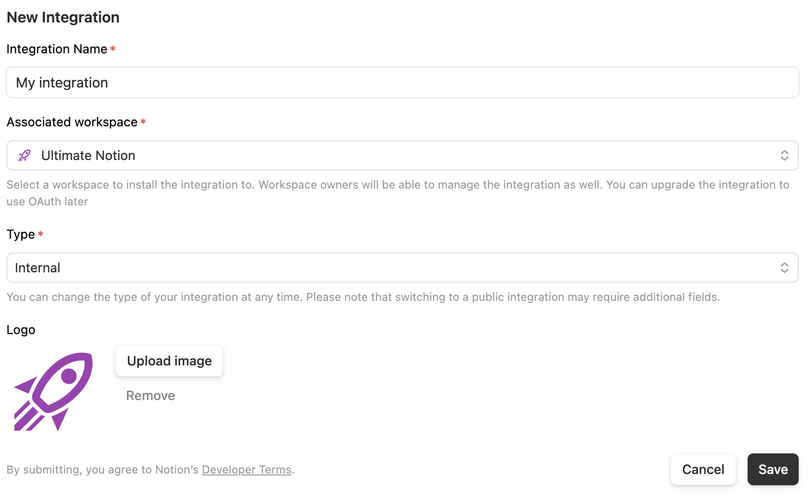
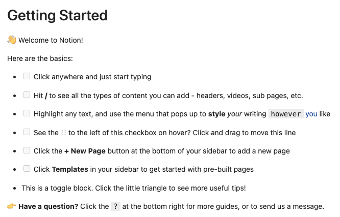

# Getting started

## Installation

To install Ultimate Notion, simply run:

```console
pip install ultimate-notion
```

or to install all additional dependencies, use:

```console
pip install 'ultimate-notion[all]'
```

Ultimate Notion requires Python 3.10 or higher. Depending on your system,
you might need to use [pyenv], [conda], etc. to install a more recent version.

## Creating an integration

1. Open [Notion] and select a workspace
2. Click <kbd>⚙ Settings</kbd> in the left sidebar
3. In the settings window, click <kbd>Connections</kbd> in the *Workspace* section at the bottom, not the one at the top
4. Click <kbd>↗ Develop or manage integrations</kbd> at the bottom

This takes you to the [My integrations] page. Now:

1. Click <kbd>+ New integration</kbd>
2. Provide a name and select your workspace
3. Optionally add a [logo]
4. Select **Internal** as the integration type
5. Click <kbd>Save</kbd>

{:style="height:400px; display:block; margin-left:auto; margin-right:auto;"}

After creation, you'll see a success popup. Click <kbd>Configure integration settings</kbd> to access your integration's preferences.

### Configuring your integration

In the *Configuration* tab:

1. Click <kbd>Show</kbd> next to *Internal Integration Secret*
2. Copy and save the authentication token (starts with `ntn_`)
3. Under *Capabilities*, grant all capabilities for maximum flexibility
4. Click <kbd>Save</kbd>

{:style="height:400px; display:block; margin-left:auto; margin-right:auto;"}

This token will be used by Ultimate Notion for authentication and must be provided in the [configuration](configuration.md).

## Granting page access

Before granting access to pages, verify your integration appears in your workspace.
Go to <kbd>⚙ Settings</kbd> » <kbd>Connections</kbd> and confirm your integration is listed there.
Note again, that there are two <kbd>Connections</kbd> entries in the sidebar. Click the one at the bottom.

Your integration needs explicit access to pages. To grant access:

1. Open any page in Notion
2. Click the **⋯** menu in the upper right corner
3. Select <kbd>Connections</kbd>
4. Search for and select your integration
5. Confirm access

{:style="width:600px; display:block; margin-left:auto; margin-right:auto;"}

Your integration now has access to this page and all its child pages.

Alternatively, you can manage page access from <kbd>⚙ Settings</kbd> » <kbd>Connections</kbd> in your workspace.

## Loading a Notion page

Test your integration with this code. Replace `PAGE_TITLE` with the title of a page you've granted access to:

``` py
--8<-- "examples/getting_started.py"
```

Run the code to see the rendered output. In [JupyterLab], you'll see formatted Markdown; in a terminal, you'll see plain text.

{style="width:600px; display:block; margin-left:auto; margin-right:auto;"}

## Understanding Notion concepts

### Pages and blocks

In Notion, everything is either a **page** or a **block**. A page contains blocks like headings, text, lists, tables, and quotes.

If a page is deleted using Ultimate Notion, it is not deleted directly but moved to the trash can, i.e.,
"🗑️ Trash" in the sidebar, for a period of 30 days before it is deleted.

### Databases

A **database** is a special block type that can exist:

- Within a page (inline database)
- At the same level as pages (full-page database)

Every database has a **schema** defined by a set of **properties** (columns) with specific types (text, number,
URL, etc.) that impose structured data on every page within that database. Only pages contained in a database
have properties.

Besides the properties of pages contained in a database, every page has **attributes** such as title, cover,
icon, or whether it is in the trash. The **title** attribute is special and will always be included as a
property in the schema if the page is in a database. The property name of the title attribute can be customized.
Think of the title property as a human-readable identifier, which does not have to be unique! This concept is
important when **relation** properties are used between different databases, as the title property of a linked
page will show up in the relation property of the other database.

A special type of database is a **wiki database** that comes with a pre-defined schema, i.e., title,
last-edited-time, owner, tags, verification.

!!! warning
    Linked databases (marked with ↗) aren't accessible via the API—always work with the source database.

### Page hierarchy and permissions

Pages can contain other pages, creating a hierarchy:

- **Parent page**: Contains other pages
- **Child pages**: Contained within another page
- **Root pages**: Directly in the workspace

Integration permissions inherit from parent pages, so granting access to a parent automatically includes all children.

### Identifiers

Notion assigns a **UUID** (32-character identifier) to every page, block, user, and property. These UUIDs remain
constant even when titles change.

You can find page/database UUIDs by:

1. Using <kbd>Copy link</kbd> from the **···** menu
2. Extracting from the URL: `https://www.notion.so/{TITLE}-{UUID}`

Notion also provides a shortened URL format: `https://notion.so/{UUID}`

### Text handling

Notion treats empty strings and unset values equivalently. Ultimate Notion returns `None` for empty strings to
maintain consistency, but displays them as `""` when converting objects to strings.

[Notion]: https://www.notion.so
[My integrations]: https://www.notion.so/my-integrations
[logo]: ../assets/images/logo_integration.png
[pyenv]: https://github.com/pyenv/pyenv
[conda]: https://docs.conda.io/
[JupyterLab]: https://jupyterlab.readthedocs.io/
