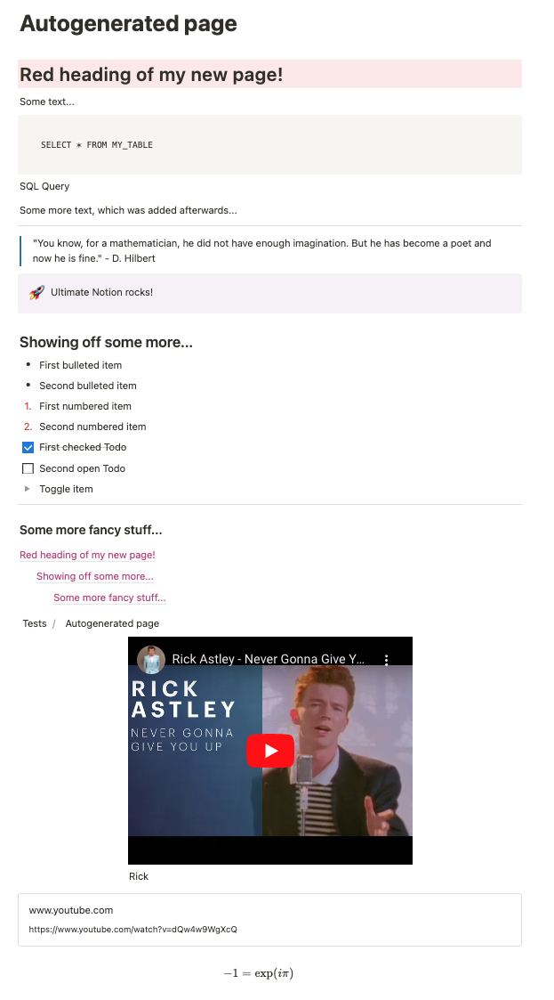

# Creating and modifying pages

## Creating a new page

To create a new page, we first create a session and retrieve a root page, which
will then hold our new page:

```python
import ultimate_notion as uno

ROOT_PAGE = 'Tests'  # page with connected Ultimate Notion integration
notion = uno.Session.get_or_create()

root_page = notion.search_page(ROOT_PAGE).item()
```

Using `root_page` we can simply create a new page with:

```python
my_page = notion.create_page(parent=root_page, title='Autogenerated page')
```

Our new page is empty and we can check that with:

```python
assert my_page.children == []
```

## Adding content to a page

Our new page can now be populated with the typical [Notion blocks] from the [blocks module].
Let's create a heading 1 block and append it to our page with:

```python
h1 = uno.Heading1('My new page')
my_page.append(h1)
```

We can also append several blocks at once:

```python
my_page.append([
    uno.Paragraph('Some text...'),
    uno.Code(
        'SELECT * FROM MY_TABLE',
        language=uno.CodeLang.SQL,
        caption='SQL Query'
        ),
    uno.Quote(
        '"You know, for a mathematician, he did not have enough imagination. '
        'But he has become a poet and now he is fine." - D. Hilbert',
        color=uno.Color.BLUE
        ),
    uno.Callout('Ultimate Notion rocks!', color=uno.BGColor.PURPLE, icon='🚀'),
    uno.Heading2('Showing off some more...'),
    uno.BulletedItem('First bulleted item'),
    uno.BulletedItem('Second bulleted item'),
    uno.NumberedItem('First numbered item', color=uno.Color.RED),
    uno.NumberedItem('Second numbered item', color=uno.Color.RED),
    uno.ToDoItem('First checked Todo', checked=True),
    uno.ToDoItem('Second open Todo'),
    uno.ToggleItem('Toggle item'),
    uno.Divider(),
    uno.Heading3('Some more fancy stuff...'),
    uno.TableOfContents(color=uno.Color.PINK),
    uno.Breadcrumb(),
    uno.Embed('https://www.youtube.com/watch?v=dQw4w9WgXcQ', caption='Rick'),
    uno.Bookmark('https://www.youtube.com/watch?v=dQw4w9WgXcQ'),
    uno.Equation(r'-1 = \exp(i \pi)'),
    ]
)
```

Let's say we have forgotten one block and want to add it at a specific position, i.e. `after` another block:

```python
new_paragraph = uno.Paragraph('Some more text, which was added afterwards...')
my_page.append(new_paragraph, after=my_page.children[2])
```

As the block reference `new_paragraph` is automatically updated when appended to the page, we can also use it now
as a reference to append a new block after it, e.g.:

```python
to_be_deleted_paragraph = uno.Paragraph('Block to be deleted')
my_page.append(to_be_deleted_paragraph, after=new_paragraph)
```

To delete a block from a page, we can just call `.delete()` on it:

```python
to_be_deleted_paragraph.delete()
```

This is how our page now looks like this:

{: style="width:600px; display:block; margin-left:auto; margin-right:auto;"}

!!! note

    For type hinting, use [AnyBlock] for a general block, e.g.

    ```python
    page_children: uno.AnyBlock = my_page.children
    ```

## Nested blocks

A really useful feature of Notion blocks is that most of them can be nested
Therefore some blocks, like paragaphs, quotes, toggable headings and so on, can have `children`
and thus also have an `append` method, just like a page.

Let's create a new page where we store various file types under a toggable Headning:

```python
file_page = notion.create_page(parent=root_page, title='Page with nested blocks')

heading = uno.Heading1('My files', toggleable=True)
file_page.append(heading)

heading.append([
    uno.File(
        'robots.txt',
        'https://www.google.de/robots.txt',
        caption='Google Robots'
        ),
    uno.Image(
        'https://cdn.pixabay.com/photo/2019/08/06/09/16/flowers-4387827_1280.jpg',
        caption='Path on meadow'
        ),
    uno.Video(
        'https://www.youtube.com/watch?v=dQw4w9WgXcQ',
        caption='Rick Roll'
        ),
    uno.PDF(
        'https://www.iktz-hd.de/fileadmin/user_upload/dummy.pdf',
        caption='Dummy PDF'
        ),
])
```

!!! info

    We can only add children blocks to a block that is already *in notion*, i.e. was already
    appended to a page. You can also programmatically check that with the [in_notion] property
    of a block.

## Columns & tables

Assume that we want to structure our page a bit more using columns. We define a set of columns
using the [Columns] block. This block now behaves like a list of where each element presents a column.
We can now just append to a column, e.g.:

```python
page = notion.create_page(parent=root_page, title='Page with advanced blocks')

cols = uno.Columns(2)
page.append(cols)

cols[0].append(uno.Paragraph('Column 1'))
cols[1].append(uno.Paragraph('Column 2'))
```

Using the some concept, we can also create a table but this time we specify the cells instead of columns.
Creating a 4x6 table with 4 rows and 6 columns where the first row is a header for the columns, thus we set
`column_header` to true, which might be a bit counter-intuitive at first:

```python
table = uno.Table(4, 6, row_header=False, column_header=True)

page.append(table)
```

!!! failure

    We now have an empty table but filling wit with content is currently not implemented 🙈.

To access the rows and cells we can call:

```python
rows = table.rows
cells_of_first_row = rows[0].cells
```

## Advanced blocks

There are some additional more advanced blocks like link to a page and synced block. Let's take a look at those.

Assume we have our "Getting Started"-page and want to link to it from the page, we just created above.

```python
target_page = notion.search_page('Getting Started').item()

page.append(uno.LinkToPage(target_page))
```

A synced block is a different kind of beast. We first have to define an *original* block, which acts
as a container for other blocks that should be synced. Then we append various blocks to it and finally
create a *synced* block, which will be synchronized with the content of the original block.

```python
orig_block = uno.SyncedBlock(uno.Paragraph('This is a synced paragraph'))
page.append(orig_block)

sync_block = orig_block.create_synced()
page.append(sync_block)
```

Now we have two paragraphs, with the second always reflecting the content of the first.

## Working with texts

So far we passed to most blocks basic strings and only provided in some cases a colour for the
whole block. Notion allows much fancier formatting for text but also inline formulas and mentions of various types.
This is supported by the four types [Text], [Math], [Mention] and [RichText].
The first three types are the primary building blocks and when composed result in a [RichText].
An example illustrates this:

```python
page = notion.create_page(parent=root_page, title='Page with fancy text')

rt = uno.Text('This is a ') + uno.Text('bold', bold=True) + uno.Text(' word.\n')
assert isinstance(rt, uno.RichText)

rt += 'We can even add a normal string to it.\n'
rt += uno.Text('Now some ') + uno.Text('inline formula: ', color=uno.Color.RED)
rt += uno.Math(r'-1 = e^{i \pi}') + '\n'
rt += uno.join([
    uno.Text('All', italic=True),
    uno.Text('possible', underline=True),
    uno.Text('formatting, ', color=uno.BGColor.PURPLE),
    uno.Text('is', code=True),
    uno.Text('it?', strikethrough=True),
    uno.Text('it not?', italic=True, bold=True)
    ])

page.append(uno.Paragraph(rt))
```

To achieve fancy formatting, we have to mix and match [Text] elements to compose the formatting we want.
For longer texts without content, `uno.RichText` should be directly used as there is a length limitation on `Text.

!!! warning

    Be cautious with the operator precedence of `+=` and `+` in the example above.
    While `rt += 'We can even add a normal string to it.\n'` works just as `rt`
    is already of type `RichText`, `rt += 'We can even add a normal string to '` +  uno.Text('it.'n')'
    would not work as we would first conatenate a `str` with a `Text` before we append it to a `RichText`.

Let's see how we can mention a person, page, database or even a date.

```python
from datetime import datetime

person = notion.search_user('Florian Wilhelm').item()
dummy_db = notion.create_db(parent=root_page)
intro_page = notion.search_page('Getting Started').item()
my_date = datetime(1592, 3, 14) # or better use the pendulum library

rt = uno.join([
    uno.Mention(person),
    uno.Mention(dummy_db),
    uno.Mention(intro_page),
    uno.Mention(my_date)
    ], delim=' : ')
page.append(uno.Paragraph(rt))
```

Let's take a look how our fancy text page looks like in the end.

{: style="width:600px; display:block; margin-left:auto; margin-right:auto;"}

!!! note

    For type hinting, use [AnyText] for a general text element, which is either
    [Text], [Math], [Mention] and [RichText], e.g.

    ```python
    text: uno.AnyText = uno.Text('Some text...')
    ```

[Notion blocks]: https://www.notion.so/help/category/write-edit-and-customize
[blocks module]: ../../reference/ultimate_notion/blocks/#ultimate_notion.blocks
[Paragraph block]: ../../reference/ultimate_notion/blocks/#ultimate_notion.blocks.Paragraph
[AnyBlock]: ../../reference/ultimate_notion/blocks/#ultimate_notion.blocks.AnyBlock
[in_notion]: ../../reference/ultimate_notion/blocks/#ultimate_notion.blocks.DataObject.in_notion
[Columns]: ../../reference/ultimate_notion/blocks/#ultimate_notion.blocks.Columns
[Text]: ../../reference/ultimate_notion/text/#ultimate_notion.text.Text
[Math]: ../../reference/ultimate_notion/text/#ultimate_notion.text.Math
[Mention]: ../../reference/ultimate_notion/text/#ultimate_notion.text.Mention
[RichText]: ../../reference/ultimate_notion/text/#ultimate_notion.text.RichText
