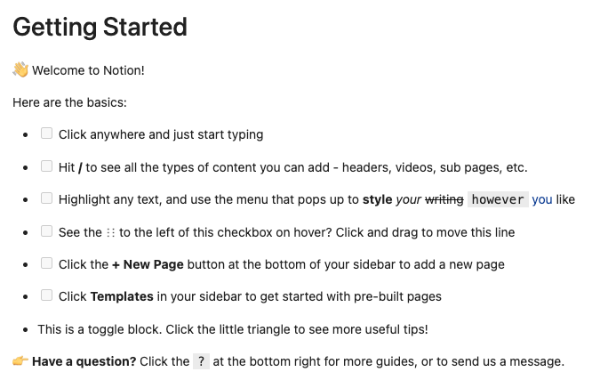
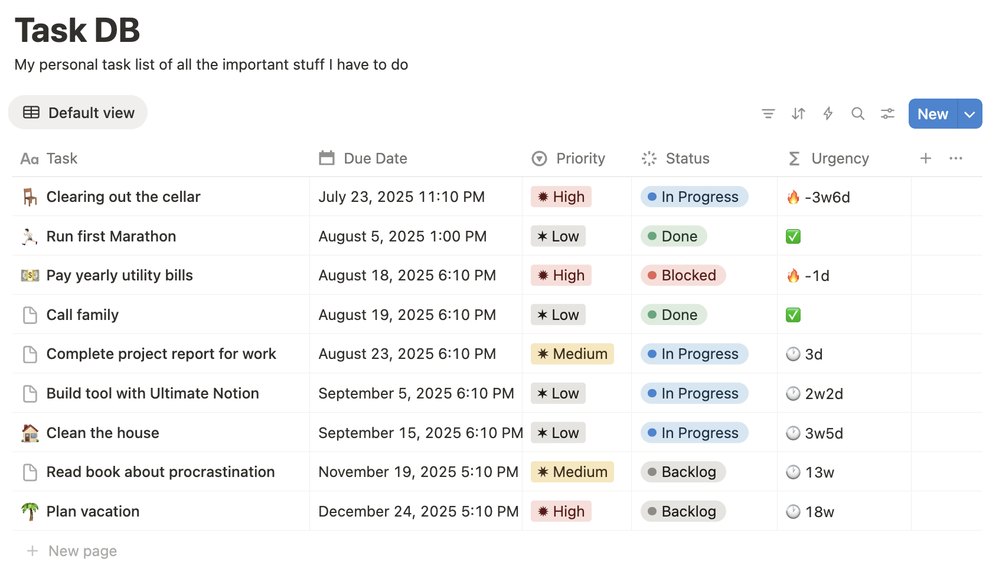

# Introduction to pages

Pages are one of the most essential building blocks of Notion.
A page has certain *attributes* such as a title, cover, icon, and wether it is deleted
(archived in the bin) or not.
Items within a database, or rows if you will, are just pages and the schema of the database,
that is the set of columns and their types, imposes *properties* on each contained page.

Beside attributes and properties, a page also has a *content*, consisting of *blocks* for text
and everything you can chose in the Notion UI by hitting <kbd>/</kbd>. As a page can be contained
in another page, we can have a *parent* and *children* relation between pages.
Check out the [Page object] to find out more about accessing these functionalities.

## Searching for a page

To get started, assume we have a page called "Getting Started", which we want to access using Ultimate Notion.

```python
import ultimate_notion as uno

notion = uno.Session.get_or_create()  # if NOTION_TOKEN is set in environment

intro_page = notion.search_page('Getting Started').item()
```

We can also display that content of the page within [Jupyter Lab] or even at the console with

```python
intro_page.show()
```

In a Jupyter notebook, you would see

{: style="width:600px; display:block; margin-left:auto; margin-right:auto;"}

## Properties of a page

The properties of a page can be accessed with the `props` attribute of each page object.
Assume we have a page acting like a task in a database similar to the [Task List example] like this:

{: style="width:600px; display:block; margin-left:auto; margin-right:auto;"}

We search for `Task DB`, fetch all pages in a [View] and select the `Run first Marathon`-page:

```python
task_view = notion.search_db('Task DB').item().fetch_all()
task = task_view.search_page('Run first Marathon').item()
```

!!! note
    As Notion rarely has any uniqueness guarantees, many methods return [SList], i.e. <b>S</b>ingle-item **List**,
    a special list type for lists that *typically* hold a single item. An `SList` behaves exactly like
    a normal Python list except of the fact that it provides an additional [item] method to retrieve the
    single item or raise an exception otherwise.

To check again for the date of the marathon, and also if we completed this task, we can use `props.col_name`, like

```python
print(f'Task "{task.title}" was {task.props.status} on {task.props.due_date}')
```

to get the output:

```console
Task "Run first Marathon" was Done on 2023-11-24 17:10:00+01:00
```

The actual property names like `status` and `due_date` can be easily find out by looking at the schema of the database
holding our page, with:

```python
task.database.schema.show()
```

returning the actual column name, the property type and the Python attribute name within `props`:

```console
Name      Property    Attribute
--------  ----------  -----------
Urgency   Formula     urgency
Due Date  Date        due_date
Status    Select      status
Priority  Select      priority
Task      Title       task
```

It is also possible to access the property directly with the column name using the indexing operator
`[column name]`, e.g.:

```python
f'Task "{task.title}" was {task.props["Status"]} on {task.props["Due Date"]}'
```

## Working with properties

The properties of a page are all subclasses of [PropertyValue] and each provides a `value` attribute to
access the actual low-level Python object. The only exception to this rule are textual column types
and thus page properties like [Title], [Text], etc. as those will return a [RichText] object, which
can be converted to a sring using the `str()` function or the `to_plain_text()` method.

To change a page property, we can just assign a new value to the corresponding [PropertyValue]. This
is possible with the corresponding property value from the `value` attribute but also using the
low-level Python object. To demonstrate this we gonna set a different due date for our task but
first we save the current value to switch it back again.

```python
from datetime import datetime, timedelta

old_due_date = task.props.due_date
# assign a datetime Python object
new_due_date_dt = datetime.now() + timedelta(days=7)
task.props.due_date = new_due_date_dt
assert task.props.due_date.value.date() == new_due_date_dt.date()

# reassign the old property value object
task.props.due_date = old_due_date
assert task.props.due_date == old_due_date
```

Those change will also be automatically reflected on the Notion server. So each assignment
triggers an update web request.

Here is an example on how to change the task status, which is a select property. First we
get the list of all options by accessing the the corresponding column type of the property with:

```python
options = task.database.schema.status.type.options
```

This generates a dictionary of [Option] objects:

```console
{'backlog': <Option: 'Backlog' at 0x13513d570>,
 'in_progress': <Option: 'In Progress' at 0x13513d630>,
 'blocked': <Option: 'Blocked' at 0x13513d420>,
 'done': <Option: 'Done' at 0x1350fa140>}
```

We now assign the `In Progress` option to our task with:

```python
task.props.status = options['In Progress']
```

!!! info
    The functionality around updating select/multi-select properties will be changed in
    the future to make the expderience more user-friendly.

[Page object]: ../../reference/ultimate_notion/page/#ultimate_notion.page.Page
[Task List example]: ../../usage/db_advanced/#two-way-self-relations
[View]: ../../reference/ultimate_notion/view/#ultimate_notion.view.View
[SList]: ../../reference/ultimate_notion/utils/#ultimate_notion.utils.SList
[item]: ../../reference/ultimate_notion/utils/#ultimate_notion.utils.SList.item
[PropertyValue]: ../../reference/ultimate_notion/props/#ultimate_notion.props.PropertyValue
[Title]: ../../reference/ultimate_notion/props/#ultimate_notion.props.Title
[Text]: ../../reference/ultimate_notion/props/#ultimate_notion.props.Text
[RichText]: ../../reference/ultimate_notion/objects/#ultimate_notion.objects.RichText
[Option]: ../../reference/ultimate_notion/objects/#ultimate_notion.objects.Option
